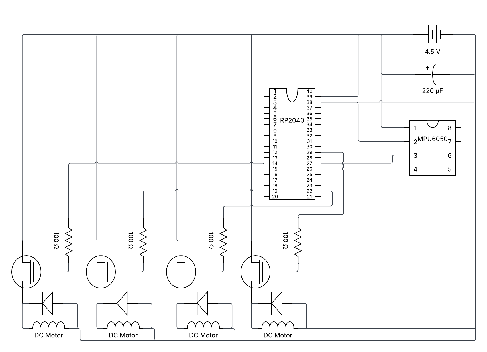

**Project Overview**

This repository contains a small flight-control program for the Raspberry Pi Pico (RP2040). It reads an IMU (MPU6050), runs a simple flight-control loop, and drives motor outputs (PWM). It's intended as a hobby / learning project.

**Prerequisites**

- **Toolchain**: `arm-none-eabi-gcc` (ARM embedded toolchain)
- **Build tools**: `cmake`, `ninja`
- **Pico SDK**: either installed locally or available via `PICO_SDK_PATH` (see project `CMakeLists.txt`)
- **Flashing tools**: use the Pico UF2 bootloader (drag-and-drop) or the included VS Code tasks which call `picotool` / `openocd`.

**Quick Build (cmd.exe)**

1. Create and configure the build directory:

```
cmake -S . -B build -G Ninja -DPICO_SDK_PATH="%USERPROFILE%\\.pico-sdk\\pico-sdk"
```

2. Build the firmware:

```
ninja -C build
```

Alternatively, use the provided VS Code tasks: `Compile Project` builds with the project `build` directory.

**Flash / Run**

- Using UF2: put the Pico into BOOTSEL mode and copy `build\drone.uf2` to the mounted drive.
- Using the provided tasks: run the `Run Project` or `Flash` tasks in VS Code (they call `picotool` and `openocd` respectively).

**Hardware**

- 1 x 4.5v Power Supply
- 1 x RP2040 (MCU)
- 1 x MPU6050 (IMU)
- 4 x 716 Coreless Brushed DC Motor 
- 4 x AO3400A N-Channel MOSFET
- 4 x 100Ω Resistor
- 4 x SS14 Schottky diode
- 1 x 220µF Capacitor

**Wiring**



**Source Layout**

- `drone.c` — application entry point and system initialization
- `flight_control.c` / `flight_control.h` — control loop and stabilization logic
- `motor_adjustment.c` / `motor_adjustment.h` — motor output and ESC/motor interfacing
- `mpu6050.c` / `mpu6050.h` — IMU driver (I2C)
- `vector_3d.h` — small math helpers for 3D vectors
- `CMakeLists.txt` — project build configuration
